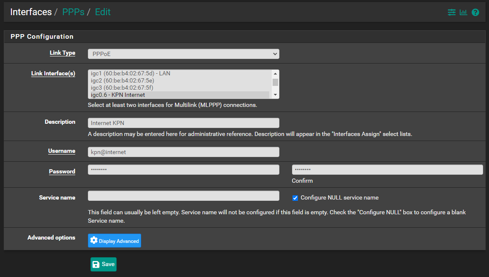
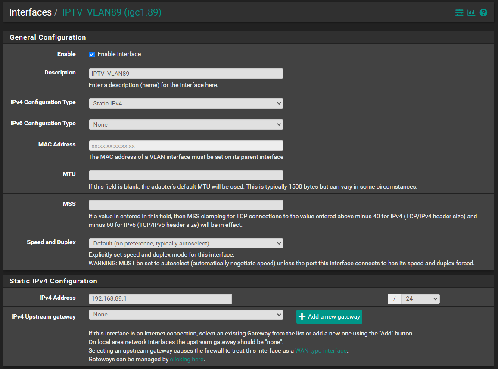
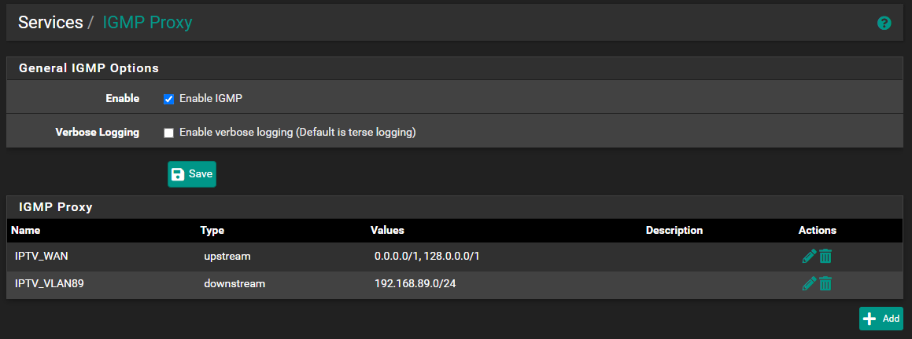
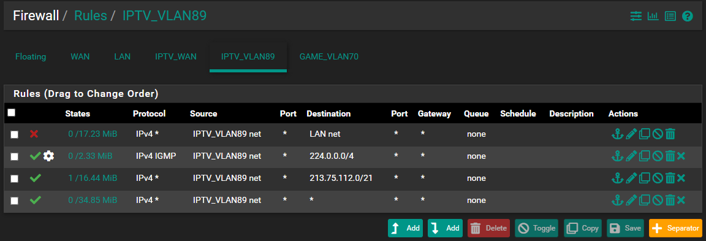

### How to Setup KPN on pfSense with seperate TV VLAN

In this How-To we are going to use ```VLAN89``` as our seperate TV VLAN, you can choose to use your own VLAN number.

### Step. 1

After install pfSense go to

```
Interface > Assignments > VLANs
```


Create 2 VLANs on your WAN interface:
```VLAN6```
```VLAN4```

Create 1 VLAN on your LAN interface:
```VLAN89```

### Step. 2

Go to

```
Interface > Assignments > PPPs
```

Add a new interface and link it with your WAN port



Username 
```kpn@internet```

Password 
```kpn```

### Step. 3

Go to 

```
Interface > Assignments 
```


Set Interface WAN to PPPOE0

Add ```VLAN4``` for ```IPTV_WAN```

Add ```VLAN89``` for ```IPTV_VLAN89 ```

### Step. 4

Edit Interface IPTV_WAN


Set Send options:
```
dhcp-class-identifier "IPTV_RG"
```

Set Request options:
```
subnet-mask, routers, broadcast-address, classless-routes
```

### Step. 5

Edit Interface IPTV_VLAN89



IPv4 Configuration Type: 
```Static IPv4```

IPv4 Address: 
```192.168.89.1```

### Step. 6

Go to

```
Services > DHCP Server > IPTV_VLAN89
```


Set Range:
```192.168.89.10 / 192.168.89.245```
(*Or use your own range)


Set DNS Servers:
```195.121.1.34``` 
```195.121.1.66```


Set Domain name:
```kpn.home```


Set BOOTP/DHCP Options 
```
60 / Text / IPTV_RG
```
```
28 / IP address or host / 192.168.89.255
```

### Step. 7

Go to

```
Services > IGMP Proxy
```



Here we are going to add 2 streams (Upstream and Downstream)

```
Add Upstream
```

Set Interface: ```IPTV_WAN```

Set Type: ```Upstream Interface```

Create 2 networks: ```0.0.0.0 / 1 ``` ```128.0.0.0 / 1```


```
Add Downstream
```
Set Interface: ```IPTV_VLAN89```

Set Type: ```Downstream Interface```

Create 1 networks: ```192.168.89.0 / 24```

### Step. 8

Go to

```
Firewall > NAT > Outbound
```


Set to Hybrid Outbound NAT

Create a Mapping


### Step. 9

Go to

```
Firewall > Rules > IPTV_WAN
```

Add the following rules


On the IPv4 IGMP rule enable the following line.


### Step. 10

Go to

```
Firewall > Rules > IPTV_VLAN89
```

Add the following rules



On the IPv4 IGMP rule enable the following line.

